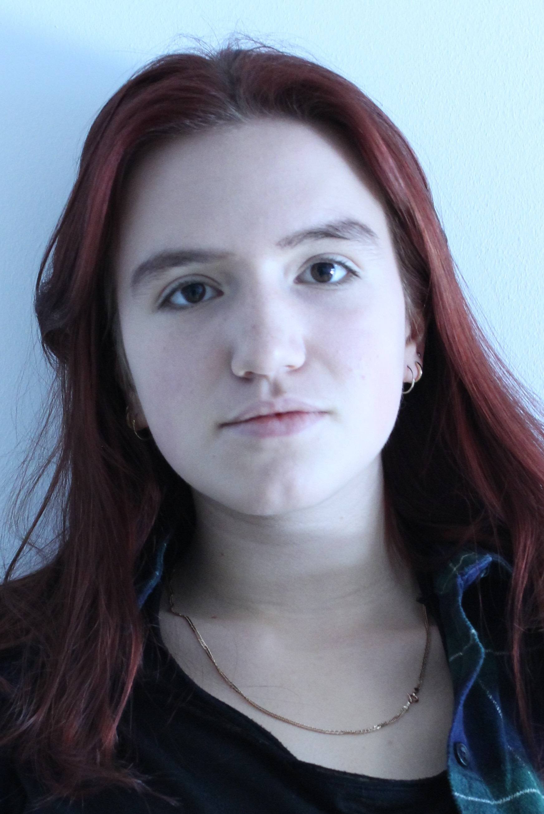

# CSE1105 Template Repository

This a template repository to help you get started on making the best project possible!

You can download the latest version [here](https://github.com/SERG-Delft/TI1216/releases)

http://stackoverflow.com/a/6466993

## How to import into your IDE

Eclipse:
[http://javapapers.com/java/import-maven-project-into-eclipse/](http://javapapers.com/java/import-maven-project-into-eclipse/)

Intellij:  
[https://www.jetbrains.com/help/idea/2016.2/importing-project-from-maven-model.html](https://www.jetbrains.com/help/idea/2016.2/importing-project-from-maven-model.html)

## Getting your weekly reports

**Jacoco**:  
Run `maven install` ([Intellij](https://www.jetbrains.com/help/idea/2016.3/getting-started-with-maven.html#execute_maven_goal)/[Eclipse](http://imgur.com/a/6q7pV))

**Checkstyle**:  
Run `maven site`

## Team

Victor Roest (vroest) [Personal Development Plan](doc/personal-development-plans/victor.md)

Vykintas Civas (vcivas) [Personal Development Plan](doc/personal-development-plans/Vykintas_personal_plan.md)

Agata Kordyl (akordyl) [Personal Development Plan](doc/personal-development-plans/agata_pdp.md)

Alin Dondera (adondera) [Personal Development Plan](doc/personal-development-plans/Alin_Plan.md)

Merthan Tukus [Personal Development Plan](doc/personal-development-plans/Merthan.md)

Elena Ibanez [Personal Development Plan](doc/personal-development-plans/elena.md)

