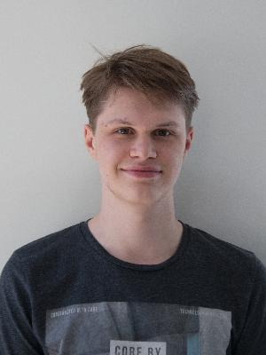
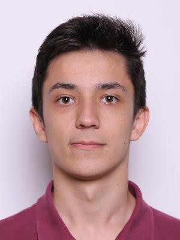
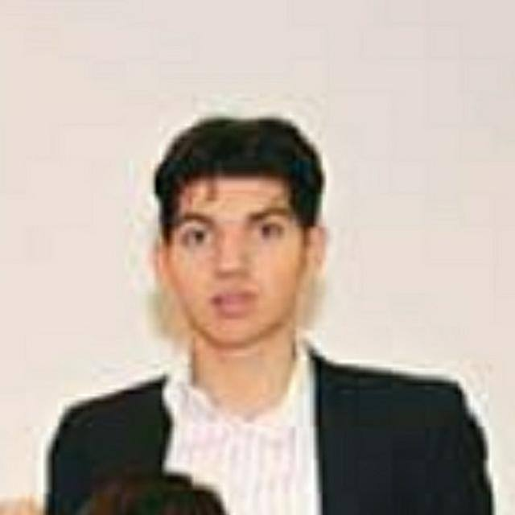
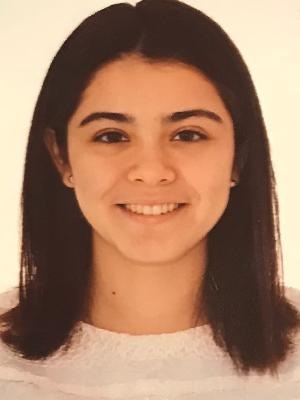

# CSE1105 - GoGreen 

This repository is a complete Java Desktop Application project consisting of 2 parts - the Server & the Client. The project is works like a social network for tracking the amount of carbon saved per user.

## How to import into your IDE

Eclipse:
[http://javapapers.com/java/import-maven-project-into-eclipse/](http://javapapers.com/java/import-maven-project-into-eclipse/)

Intellij:  
[https://www.jetbrains.com/help/idea/2016.2/importing-project-from-maven-model.html](https://www.jetbrains.com/help/idea/2016.2/importing-project-from-maven-model.html)

## Getting your weekly reports

**Jacoco**:  
Run `mvn install` ([Intellij](https://www.jetbrains.com/help/idea/2016.3/getting-started-with-maven.html#execute_maven_goal)/[Eclipse](http://imgur.com/a/6q7pV))

**Checkstyle**:  
Run `mvn site`

## Running it
### Client
Prior to running make sure all dependencies are installed (`mvn install`)
```bash
cd client
mvn --also-make clean compile exec:java  # Or use the IntelliJ run config
```

## Team

Victor Roest (vroest) [Personal Development Plan](doc/personal-development-plans/victor.md)



Vykintas Civas (vcivas) [Personal Development Plan](doc/personal-development-plans/Vykintas_personal_plan.md)


Agata Kordyl (akordyl) [Personal Development Plan](doc/personal-development-plans/agata_pdp.md)


Alin Dondera (adondera) [Personal Development Plan](doc/personal-development-plans/Alin_Plan.md)



Merthan Tukus [Personal Development Plan](doc/personal-development-plans/Merthan.md)



Elena Ibanez [Personal Development Plan](doc/personal-development-plans/elena.md)


